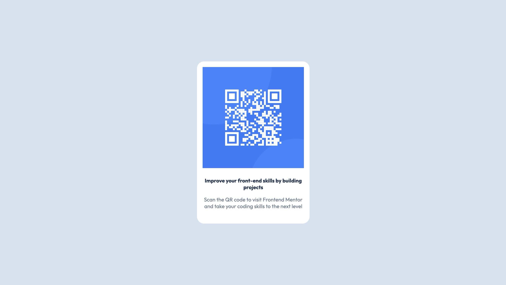

# Frontend Mentor - QR code component solution

This is a solution to the [QR code component challenge on Frontend Mentor](https://www.frontendmentor.io/challenges/qr-code-component-iux_sIO_H). Frontend Mentor challenges help you improve your coding skills by building realistic projects.

## Overview

### Screenshot




### Links

- [Solution](https://github.com/Lokesh8055/frontendmentor.io/tree/main/qr-code-component)
- [LiveSite](https://qr-code-component-lp.netlify.app/)

## My process

### Built with

- Semantic HTML5 markup
- CSS custom properties
- FlexBox
- Mobile-first workflow

### What I learned

Learned about CSS variables and how i can reuse styles

```css
:root {
  --white: #fff;
  --slate-300: #d5e1ef;
  --slate-500: #68778d;
  --slate-900: #1f314f;
}
```

### Continued development

Will continue my focus on responsive web design principles in next projects

## Author

- Frontend Mentor - [@Lokesh8055](https://www.frontendmentor.io/profile/Lokesh8055)
